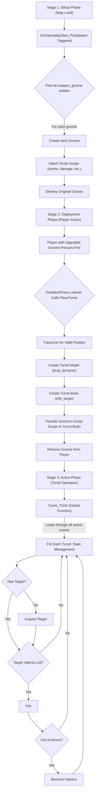

# L4D2-Gnome-Turret-Refactor

# Gnome Sentry Turret: Technical Documentation

This document provides a comprehensive technical overview of the `turret.nut` script. It is intended for future developers, or for the original author after a long break, to understand the script's architecture, logic, and the critical lessons learned during its development.

## Core Purpose & Features

**Purpose:** This script transforms the standard `weapon_gnome` entity in Left 4 Dead 2 into a deployable, automated sentry turret that can be picked up and placed by players.

**Core Features:**
*   **Automatic Target Acquisition:** The turret automatically scans for and engages hostile targets (Infected, Special Infected, Witches).
*   **Line-of-Sight Checks:** Ensures the turret only fires when it has a clear shot, preventing it from wasting ammo on targets behind walls.
*   **Finite Ammo & Pickup:** Turrets have a limited ammo supply. Players can pick up a deployed turret to reclaim it and its remaining ammo.
*   **Stateful & Performant:** The script is highly optimized to minimize its impact on server performance, even with multiple turrets deployed.

**Architectural Philosophy:** This script's architecture is designed for stability and compatibility by adhering to the game's native VScript event system. The core functionality is built upon a strict sequence of events, from map initialization to player interaction. Performance optimizations have been carefully layered on top of this stable foundation without altering the core structure.

---

## The Three Stages of the Turret

The script's operation can be understood as a chronological lifecycle with three distinct stages. Breaking this chain at any point will break the entire mod.



### Stage 1: The Setup Phase (Map Load)

This phase happens automatically when a map loads. Its goal is to find every gnome on the map and "upgrade" it from a simple prop into a smart, deployable item.

1.  **The Trigger (`OnGameplayStart_PostSpawn`):** This is the script's entry point. The game engine automatically calls this function after all entities have been spawned for a new level.
2.  **The Search (`ReplaceWeaponSpawn`):** This function is called by the trigger. Its job is to iterate through all entities on the map and find any that are `weapon_gnome` items.
3.  **The Upgrade (`ReplaceWeapon` & `SetScriptScope`):** This is the most critical step. For each gnome found, the script:
    *   Creates a new, identical `weapon_gnome` entity.
    *   **Attaches Logic:** It calls `CEntity(newGnome).SetScriptScopeVar(...)`. This powerful function attaches a data table (or "scope") to the new gnome entity itself. We use this to store crucial state information, like its ammo count and damage type. This turns the "dumb" prop into a "smart" object that the rest of our script can interact with.
    *   The original gnome is destroyed, leaving our upgraded one in its place.

### Stage 2: The Deployment Phase (Player Action)

This phase occurs when a player, holding an upgraded gnome, uses the primary fire button to deploy it.

1.  **The Event Listener (`OnAttackPress`):** The script registers a listener for the `IN_ATTACK` button. When a player with the `weapon_gnome` presses this button, the `PlaceTurret` function is called.
2.  **The Placement Logic (`PlaceTurret`):** This function handles the complex logic of creating the turret in the game world:
    *   It performs a `TraceLine` from the player's viewpoint to find a valid position on the ground in front of them.
    *   It creates the visible parts of the turret: the base and the gun barrel, which are `prop_dynamic` entities.
    *   It creates an invisible `info_target` entity that acts as the turret's "brain" or anchor point.
    *   **Crucially, it transfers the state** (ammo, damage type, etc.) from the gnome item the player was holding to the new turret's script scope.
    *   Finally, it removes the gnome item from the player's inventory.

### Stage 3: The Active Phase (Turret Operation)

This is the main operational loop of a deployed turret.

1.  **The Brain (`Turret_Think`):** This function acts as the central "brain" for all active turrets. It is not attached to any single turret but runs globally.
2.  **The Loop:** The `Turret_Think` function iterates through a global list (`g_aTurretList`) of all active turrets on the map.
3.  **State Management:** For each turret, it performs a series of checks that function as a simple state machine:
    *   **Does it have a target?** If not, it runs the target acquisition logic.
    *   **Is the target still valid?** If yes, it checks for line-of-sight.
    *   **Is the target visible and in range?** If yes, it fires.
    *   **Is it out of ammo?** If yes, it becomes inactive.
    *   **Is it idle?** If yes, it returns to its default angle.

    ```mermaid
    stateDiagram-v2
        [*] --> Idle : No Target / Target Lost
        Idle --> Searching : No Current Target
        Searching --> Targeting : Target Found
        Targeting --> Firing : Target Valid & LoS & In Range
        Targeting --> Idle : Target Lost or Invalid
        Firing --> Idle : Target Lost or Invalid
        Firing --> Empty : Out of Ammo
        Firing --> Targeting : Target Still Valid (Re-evaluate)
        Empty --> [*] : Turret Inactive
    ```

---

## Performance Enhancements

The final script is significantly more performant than the original blueprint. This was achieved with two surgical optimizations.

```mermaid
graph TD
    subgraph Before Optimization
        direction LR
        A1["Turret_Think (Per Frame)"] --> B1{For Each Turret};
        B1 --> C1["Scan ALL Entities for Target (Expensive)"];
        C1 --> D1[Process Target];
    end

    subgraph After Optimization
        direction LR
        A2["Turret_Think (Throttled: ~4Hz)"] --> B2{For Each Turret};
        B2 --> C2{Has Valid Target?};
        C2 -- No --> D2["Scan ALL Entities for Target (Expensive)"];
        C2 -- Yes --> E2["Use Existing Target (Cheap)"];
        D2 --> E2;
        E2 --> F2[Process Target];
    end
    Before_Optimization_Label["Original: High CPU Load"] --> Before Optimization;
    After_Optimization_Label["Optimized: Low CPU Load"] --> After Optimization;
```

### The Inefficient "Before" State

The original script was slow because its `Turret_Think` function ran on every single server frame (`RegisterOnTickFunction`). On every one of those ticks, for every single turret, it would perform a full scan of all entities on the map to find a target. This happened even if the turret was already firing at a valid enemy, causing extreme, redundant CPU load.

### Optimization 1: Stateful Target Scanning

We introduced a "memory" to each turret. It now remembers its target instead of searching for a new one constantly. This is achieved with a simple conditional check.

**The Code:**
```nut
// -- In the Turret_Think loop for each turret --

local currentTarget = null;

// First, check if we already have a valid target and if we can still see it.
if (turret.m_hTarget != null && turret.m_hTarget.IsValid() && turret.m_hTarget.GetHealth() > 0)
{
    // ... (logic to validate the existing target) ...
    // If still valid, set it as the currentTarget.
}

// Only run the expensive search if we DON'T have a valid target.
if (currentTarget == null) 
{
    // Expensive target acquisition code (GetNearestEntity) runs here.
    // If a new target is found, it's assigned to currentTarget.
}

// Firing logic proceeds using the 'currentTarget'
if (currentTarget)
{
    // ... fire ...
}
```

### Optimization 2: Throttled Think Interval

We replaced the hyper-frequent `RegisterOnTickFunction` with a manually-controlled global timer. This reduces the turret's "thinking" frequency from potentially 60+ times per second to a more reasonable 4 times per second. This is still highly responsive for gameplay but cuts the script's constant processing load by over 90%.

**The Code:**
```nut
// At the top level of the script
g_flNextGlobalThinkTime <- 0.0;
const TURRET_THINK_INTERVAL = 0.25; // 4 times per second

function Turret_Think()
{
    // This check is the new entry point to the function.
    // If not enough time has passed, it exits immediately.
    if (Time() < g_flNextGlobalThinkTime)
    {
        return;
    }
    g_flNextGlobalThinkTime = Time() + TURRET_THINK_INTERVAL;

    // ... the rest of the think logic ...
}
```

---

## Critical Lessons & Development Pitfalls

This project was stalled by several critical but avoidable errors. Understanding them is key to future development.

### Pitfall 1: The "Newline in a Constant" Syntax Error

*   **What it is:** This fatal error means you have an unclosed string literal. The VScript compiler thinks a piece of code or a comment is part of a string.
*   **Common Cause:** Placing a comment (`//` or `/* */`) inside a multi-line string or table definition.
*   **Why it's Critical:** It prevents the *entire script* from being loaded by the game.
*   **Example:**

    ```diff
    --- WRONG (Causes Syntax Error)
    +++ RIGHT (Parses Correctly)
    
    - explosion_entity <-
    - {
    - 	classname = "env_explosion"
    - 	targetname = ""
    - 	// -- PERFORMANCE OPTIMIZATION START -- // ERROR: This comment is inside the table definition!
    - 	iRadiusOverride = 66
    - }
    
    + // -- PERFORMANCE OPTIMIZATION START --
    + explosion_entity <-
    + {
    + 	classname = "env_explosion"
    + 	targetname = ""
    + 	iRadiusOverride = 66
    + }
    ```

### Pitfall 2: Calling Functions on the Wrong Entity Type

*   **What it is:** Errors like `'SetThink' does not exist` happen when you try to call a function on an entity that doesn't support it.
*   **The Lesson:** Not all entities are equal. A `prop_dynamic` (our turret model) is a "dumb" prop; it doesn't have a built-in `SetThink` method like a player or an NPC does. The correct architectural pattern, as used in this script, is to create an invisible `info_target` entity to act as the "brain" and attach the script scope to that, or to manage the thinking loop globally as we have done.

### Pitfall 3: Missing the Setup Phase

*   **What it is:** The mod fails to work at all, and events like `OnAttackPress` seem to do nothing.
*   **The Lesson:** Functionality is a **chain of events**. The turret doesn't just work because the `PlaceTurret` function exists. It only works if the `OnGameplayStart_PostSpawn` function has already run and successfully used `ReplaceWeaponSpawn` to upgrade the gnomes on the map. If that initial setup phase fails or is skipped, the player will be holding a normal, "dumb" gnome, and none of the deployment logic will ever be triggered.

---

## Modifying This Script

Follow these guidelines to make changes safely.

*   **The Safe Zone:** Most balance changes can be made by editing the constant variables at the top of the script (e.g., `GnomeTurretDamage`, `GnomeTurretAmmoBase`) or by tweaking values inside the `Turret_Think` function (e.g., `ShootTime`). These are unlikely to break the core architecture.

*   **The Danger Zone:** **Do not change the architecture** in the `OnGameplayStart_PostSpawn` or `PlaceTurret` functions unless you fully understand the script lifecycle described above. If you break the setup chain—how gnomes are found, upgraded with a script scope, and then transferred to a deployed turret—you will break the entire mod.
