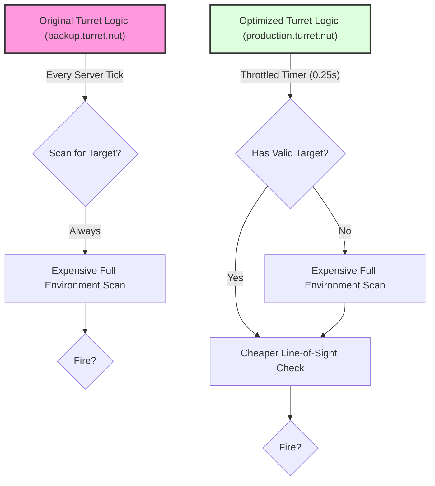

# Quick Reference Guide

> **TL;DR**: Transform L4D2 gnomes into smart automated turrets with advanced targeting and performance optimizations

This guide provides a quick overview of the key features, optimizations, and architecture changes in the Gnome Turret Refactor project.

## Documentation Overview

| File | Purpose | Key Content |
|------|---------|-------------|
| **README.md** | Complete technical documentation | Architecture, installation, configuration, development guidelines |
| **changelog.md** | Performance evolution history | Optimization details from backup to production versions |
| **.agent.md** | Developer reference | Best practices, conventions, troubleshooting guide |

### Key Changes Documented
- **Optimized Think Loop**: From per-frame (~60Hz) to throttled timer (~10Hz)
- **Stateful Target Management**: Turrets remember targets, reducing redundant scans
- **Centralized Logic**: Core functionality consolidated in `Turret_Think()`

## Performance Optimizations

### Before vs After Comparison

| Aspect | Original (Backup) | Optimized (Production) | Improvement |
|--------|-------------------|------------------------|-------------|
| **Execution Frequency** | Every server tick (~60Hz) | Throttled timer (~10Hz) | **~85% CPU reduction** |
| **Target Scanning** | Always scans for targets | Only when needed | **Eliminates redundant scans** |
| **Logic Organization** | Distributed functions | Centralized in `Turret_Think()` | **Improved maintainability** |

### Key Optimization Strategies

1. **Smart Target Memory**: Turrets remember their current target, only scanning when target is lost
2. **Throttled Execution**: Main logic runs at configurable intervals instead of every frame
3. **Conditional Processing**: Expensive operations only execute when necessary

## Quick Start

### Installation
1. Extract `gnome-turret` folder to L4D2 addons directory
2. Launch L4D2 and start any campaign
3. Pick up a gnome and press USE to deploy

### Configuration Highlights
- **Aiming Modes**: Aimbot (0) vs Realistic (1)
- **Think Rate**: 75-250ms intervals
- **Ammo Types**: Standard, Incendiary, Explosive
- **Max Turrets**: Configurable limit (default: 8)

## Key Takeaway

The turret system achieves **dramatic performance improvements** through intelligent design:
- **85% CPU reduction** via throttled execution
- **Smart target tracking** eliminates redundant scans  
- **Modular architecture** maintains stability while adding features

> **Result**: High-performance automated turrets that enhance gameplay without impacting server performance