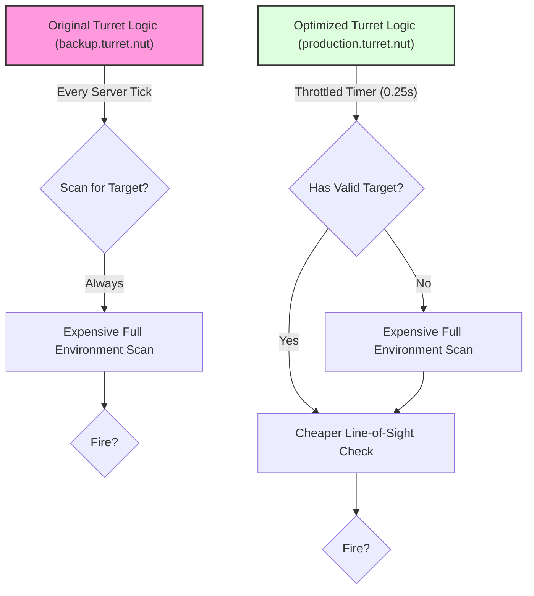

# TLDR: Gnome Sentry Turret

This project transforms the standard `weapon_gnome` in Left 4 Dead 2 into a deployable, automated sentry turret.

## Key Documentation:

*   **`README.md`**: Explains the turret's functionality, architecture (3 stages: Setup, Deployment, Active), performance optimizations, and critical development pitfalls to avoid.
*   **`changelog.md`**: Details the performance evolution from `backup.turret.nut` to `production.turret.nut`, focusing on:
    *   **Optimized Think Loop:** Changed from per-frame execution to a throttled timer (approx. 4 times/sec).
    *   **Stateful Target Management:** Turret remembers its target, reducing redundant scans.
    *   **Centralized Logic:** Core logic consolidated in `Turret_Think`.

## Core Optimizations (The "Why" of the Changelog):

The script was made significantly more performant by:

1.  **Remembering Targets:** Instead of searching for enemies every frame, the turret now only searches if it doesn't have a valid target or its current target is dead/out of sight.
2.  **Slowing Down "Thinking":** The main logic loop now runs on a 0.25-second timer instead of every server tick, drastically cutting CPU load.

## Key Takeaway:

The turret script's performance was dramatically improved by making it "smarter" (remembering targets) and "calmer" (thinking less often), without changing its core behavior. The `README.md` explains how it works and how *not* to break it. The `changelog.md` details *what* performance changes were made.
